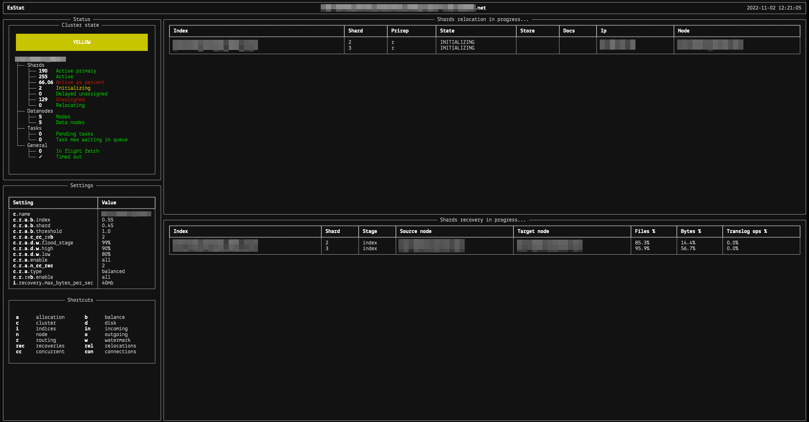

# EsStat

Simple ES cluster monitoring tool.

## What do I need?
Just Python 3. The newer the better.

## How to install?
```bash
$ git clone https://github.com/satanowski/es-stat.github
$ cd es-stat
$ python3 -m pip install .
```

## How to use?

```bash
$ esstat address.of.my.es.node.net
```


## Screenshot


